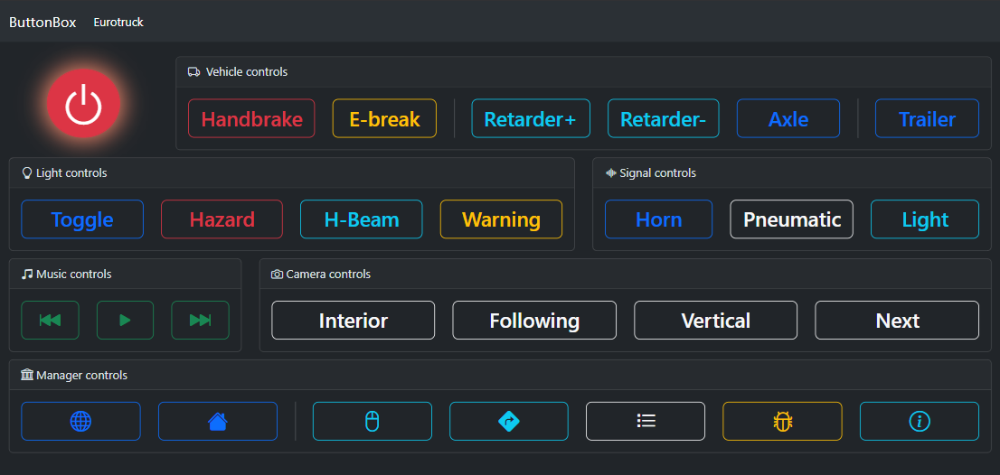

# Button Box
Webservice which is able to send keystrokes to the PC via a website

# Installation
- Install python
- Install pip
- Run `pip install -r requirements.txt`

# Execution
Launch via `python server.py`

Hosted on `http://<computerIP>:5000`

# Example

